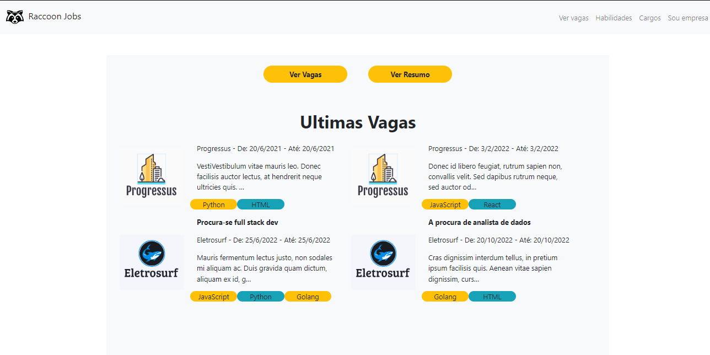
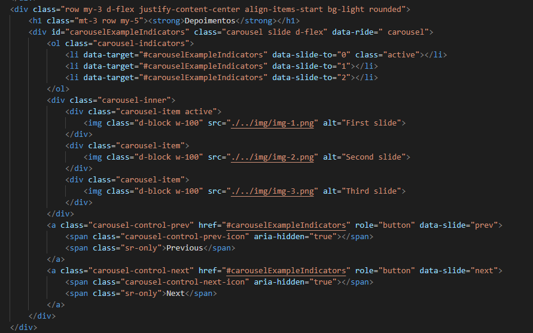
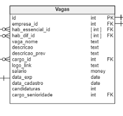
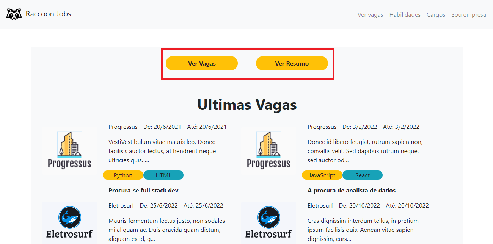
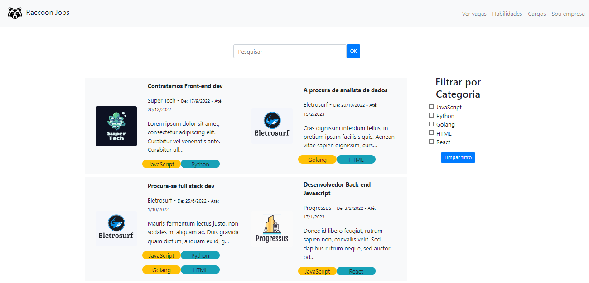
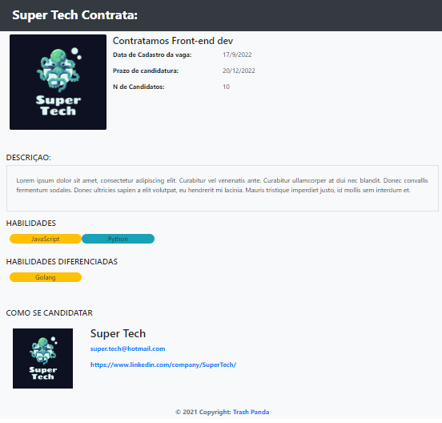
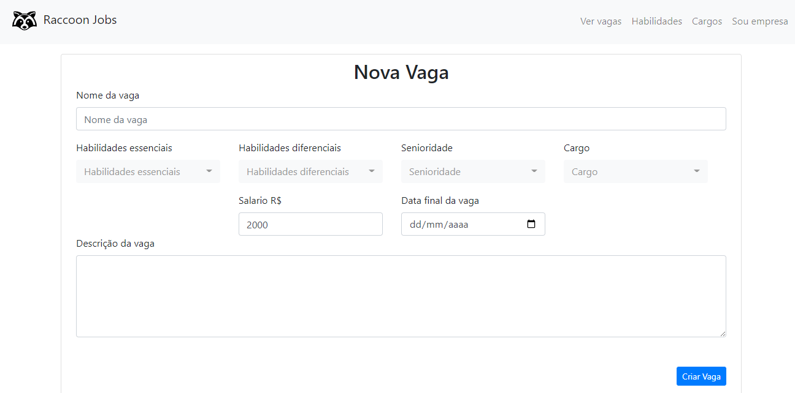

# Programação de Funcionalidades
Nesta seção são apresentadas as telas desenvolvidas para cada uma das funcionalidades do sistema.

## 1. Home page (RF-001, RF-002)



Nesta pagina, o usuario será capaz de ver um breve apresentação da plataforma e terá acesso a outras áreas da plataforma

### 1.1. Requisitos Funcionais atendidos:
|ID    | Descrição do Requisito  | Prioridade |
|------|-----------------------------------------|----|
|RF-001|O site deve apresentar na página principal deve mostrar uma apresentação da ferramenta| ALTA |
|RF-002|O site deve apresentar na página principal as opções de acesso às outras páginas: (lista de vagas)| ALTA |

### 1.2.1. Artefatos da funcionalidade (RF-001):

* home.html
* home.js





### 1.2.2. Artefatos da funcionalidade (RF-002):

* home.html
* home.js




### 1.3.1. Instruções para acesso e verificação (RF-001):
    1. Acessar a home page ./home.html

### 1.3.2. Instruções para acesso e verificação (RF-002):
    1. Acessar a home page ./home.html
    2. Clicar em Ver Vagas ou Ver Resumo

## 2. Lista de Vagas(RF-003)



Nesta pagina, o usuario será capaz de ver todas as vagas disponiveis assim como filtrar como desejar

### 2.1. Requisitos Funcionais atendidos:
|ID    | Descrição do Requisito  | Prioridade |
|------|-----------------------------------------|----|
|RF-003|O site deve possuir uma página com a listagem das vagas postadas| ALTA |

### 2.2. Artefatos da funcionalidade (RF-003):

* vagas_lista.html
* vagas_lista.js

```HTML
  <div class="col-sm-10 row" id="lista_vagas">
  </div>
```


### 2.3. Instruções para acesso e verificação (RF-003):
    1. Acessar a home page ./home.html
    2. Clicar em Ver Vagas

## 3. Descrição da vaga(RF-004)



Nesta pagina, o usuario será capaz de ver a descrição completa da vaga, assim como todas as habilidades necessarias e se candidatar a mesma

### 3.1. Requisitos Funcionais atendidos:
|ID    | Descrição do Requisito  | Prioridade |
|------|-----------------------------------------|----|
|RF-004|Ao clicar em uma vaga da lista o site deve permitir ao usuário (profissional) visualizar o texto completo da vaga com todos os detalhes da publicação e se candidatar às vagas postadas     | ALTA |

### 3.2. Artefatos da funcionalidade (RF-004):

* vaga.html
* vaga.js

```javascript
   let vaga = JSON.parse(localStorage.getItem('Vagas')).find(obj => obj.id === parseInt(id));
    let empresa = JSON.parse(localStorage.getItem('Empresas')).find(obj => obj.id ===  vaga.empresa_id)
    let contato = JSON.parse(localStorage.getItem('Contato')).find(obj => obj.id ===  empresa.contato_id)        
    let hab_ess = JSON.parse(localStorage.getItem('Habilidades')).filter(obj => vaga.hab_essencial_id.includes(obj.id))
    let hab_dif = JSON.parse(localStorage.getItem('Habilidades')).filter(obj => vaga.hab_dif_id.includes(obj.id))
  
    if (id) { 
        document.getElementById("empresaTitulo").innerHTML = `${empresa.nome } Contrata:`
        document.getElementById("empresaTitulo2").innerHTML = empresa.nome
        document.getElementById("cargoTitulo").innerHTML = vaga.vaga_nome
        document.getElementById("dataCadastro").innerHTML = fullDateString( vaga.data_cadastro)
        document.getElementById("candidaturaPrazo").innerHTML =  fullDateString(vaga.data_exp)
        document.getElementById("candidaturaN").innerHTML = vaga.candidaturas
        document.getElementById("vagaDescricao").innerHTML = vaga.descricao
        document.getElementById("e-mail").innerHTML = contato.email
        document.getElementById("linkedin").innerHTML= contato.linkedin
        document.getElementById("e-mail").src = contato.email
        document.getElementById("linkedin").src = contato.linkedin
        document.getElementById("logoEmpresa").src = empresa.logo_link
        document.getElementById("logoEmpresa2").src = empresa.logo_link
        document.getElementById("hab_ess").innerHTML = habsToPill(hab_ess,10,2)
        document.getElementById("hab_dif").innerHTML = habsToPill(hab_dif,10,2)
        }
```

### 3.3. Instruções para acesso e verificação (RF-004):
    1. Acessar a home page ./home.html
    2. Clicar em Ver Vagas
    3. Clicar no nome de uma vaga a sua escolha
    
## 4. Criar vagas (RF-005)



Nesta pagina, a empresa será capaz de criar uma nova vaga

### 4.1. Requisitos Funcionais atendidos:
|ID    | Descrição do Requisito  | Prioridade |
|------|-----------------------------------------|----|
|RF-004|Ao clicar em uma vaga da lista o site deve permitir ao usuário (profissional) visualizar o texto completo da vaga com todos os detalhes da publicação e se candidatar às vagas postadas     | ALTA |

### 4.2. Artefatos da funcionalidade (RF-005):

* criar_vaga.html
* criar_vaga.js

```javascript
   //criação de vaga
function criarVaga(empresa_id) {
    let ErrorMsg = []
    const importantFields = ['#nome', '#cargo', '#habEss', '#salario', '#expireDate', '#senioridade']
    for (let vl in importantFields) {
        if (!$(importantFields[vl]).val() || $(importantFields[vl]).val().length == 0) {
            ErrorMsg.push({ 'Erro': `${importantFields[vl]} não inserido` })
        }
    }
    if (ErrorMsg.length == 0) {
        let vagas = pegarVagas({})
        let empresas = pegarEmpresas({})
        const vaga = {
            'id': vagas.length + 1,
            'empresa_id': empresa_id,
            'hab_essencial_id': $('#habEss').val().map(i => Number(i)),
            'hab_dif_id': $('#habDif').val().map(i => Number(i)),
            'vaga_nome': $('#nome').val(),
            'descricao': $('#descricao').val(),
            'cargo_id': parseInt($('#cargo').val()),
            'salario': $('#salario').val(),
            'data_exp': $('#expireDate').val(),
            'data_cadastro': new Date(),
            'candidaturas': 0,
            'cargo_senioridade_id': parseInt($('#senioridade').val()),
        }
        vagas.push(vaga)

        for (let vl in empresas) {
            if (empresas[vl].id == empresa_id) {
                empresas[vl].vagas_id.push(vaga.id)
            }
        }
        localStorage.setItem("Vagas", JSON.stringify(vagas))
        localStorage.setItem("Empresas", JSON.stringify(empresas))

        return [{'Sucesso':'Vaga criada com sucesso'}]
    }
    return ErrorMsg
}

//prevenção de envio do form
$("#criarVagaForm").submit(function (e) {
    e.preventDefault();
    const userValid = verificarUsuario()
    if (userValid) {
        const msg = criarVaga(userValid)
        toast(msg)
        if(Object.keys(msg[0]) == 'Sucesso'){
            window.location.replace(`empresaUser.html?id=${userValid}`);
        }
    } else {
        $('#main').html('<h1 class="text-center">403 Forbbiden</h1>')
    }
});
```

### 4.3. Instruções para acesso e verificação (RF-004):
    1. Acessar a home page ./home.html
    2. Clicar em Sou Empresa e efetuar cadastro/login
    3. Clicar em Nova vaga
    4. Preencher formulario de vaga
    
## 5. Cadastro de empresa (RF-006)


Nesta pagina, a empresa terá a oportunidade de se registrar em nosso site para postar vagas.

### 5.1. Requisitos Funcionais atendidos:
|ID    | Descrição do Requisito  | Prioridade |
|------|-----------------------------------------|----|
|RF-006|O site deve permitir cadastro de usuário (Empresa) | ALTA  |

### 5.2. Artefatos da funcionalidade (RF-006):

* cadastro.html
* cadastro.js

```javascript
 if (validCnpj && validEmail && validNome && validSenha && validSenhaConf) {

    let listaUser = JSON.parse(localStorage.getItem("listaUser") || '[]')
    let EmpresaUser = JSON.parse(localStorage.getItem("EmpresaUser") || '[]')
    let empresas = JSON.parse(localStorage.getItem("Empresas") || '[]')
    let contato = JSON.parse(localStorage.getItem("Contato") || '[]')

    EmpresaUser.push(
      {
        id: (EmpresaUser.length + 1),
        empresa_id: (empresas.length + 1),
        login: email.value,
        password: senha.value.hashCode()
      }
    )
    empresas.push({
      'id': (empresas.length + 1),
      'vagas_id': [],
      'nome': nome.value, 
      'descricao': 'Essa empresa não colocou sua descrição ainda', 
      'valores': [], 
      'data_cadastro': new Date(), 
      'cnpj': cnpj.value, 
      'area': '',
      'logo_link': '../img/raccoon.svg',
      'contato_id': (contato.length + 1)
    })
    contato.push({
      'id': contato.length +1, 
      'email': '',
      'linkedin': '',
      'sede': ''     
    })
    //------------------------------------------------------------
    listaUser.push(
      {
        nomeCad: nome.value,
        emailCad: email.value,
        cnpjCad: cnpj.value,
        senhaCad: senha.value
      }
    )
    window.location.href = "../Raccoon/login.html"

    localStorage.setItem("listaUser", JSON.stringify(listaUser))
    localStorage.setItem("EmpresaUser", JSON.stringify(EmpresaUser))
    localStorage.setItem("Empresas", JSON.stringify(empresas))
    localStorage.setItem("Contato", JSON.stringify(contato))

    alert("Cadastrado com sucesso")

  } else {
    alert("Preencha os campos corretamente")
  }
}
```

### 5.3. Instruções para acesso e verificação (RF-006):
    1. Acessar a home page ./home.html
    2. Clicar em Sou Empresa 
    3. Clicar em Cadastre-se
    4. Preencher formulario de cadastro

# Programação de Funcionalidades

<span style="color:red">Pré-requisitos: <a href="2-Especificação do Projeto.md"> Especificação do Projeto</a></span>, <a href="3-Projeto de Interface.md"> Projeto de Interface</a>, <a href="4-Metodologia.md"> Metodologia</a>, <a href="3-Projeto de Interface.md"> Projeto de Interface</a>, <a href="5-Arquitetura da Solução.md"> Arquitetura da Solução</a>

Implementação do sistema descritas por meio dos requisitos funcionais e/ou não funcionais. Deve relacionar os requisitos atendidos os artefatos criados (código fonte) além das estruturas de dados utilizadas e as instruções para acesso e verificação da implementação que deve estar funcional no ambiente de hospedagem.

Para cada requisito funcional, pode ser entregue um artefato desse tipo

> **Links Úteis**:
>
> - [Trabalhando com HTML5 Local Storage e JSON](https://www.devmedia.com.br/trabalhando-com-html5-local-storage-e-json/29045)
> - [JSON Tutorial](https://www.w3resource.com/JSON)
> - [JSON Data Set Sample](https://opensource.adobe.com/Spry/samples/data_region/JSONDataSetSample.html)
> - [JSON - Introduction (W3Schools)](https://www.w3schools.com/js/js_json_intro.asp)
> - [JSON Tutorial (TutorialsPoint)](https://www.tutorialspoint.com/json/index.htm)
